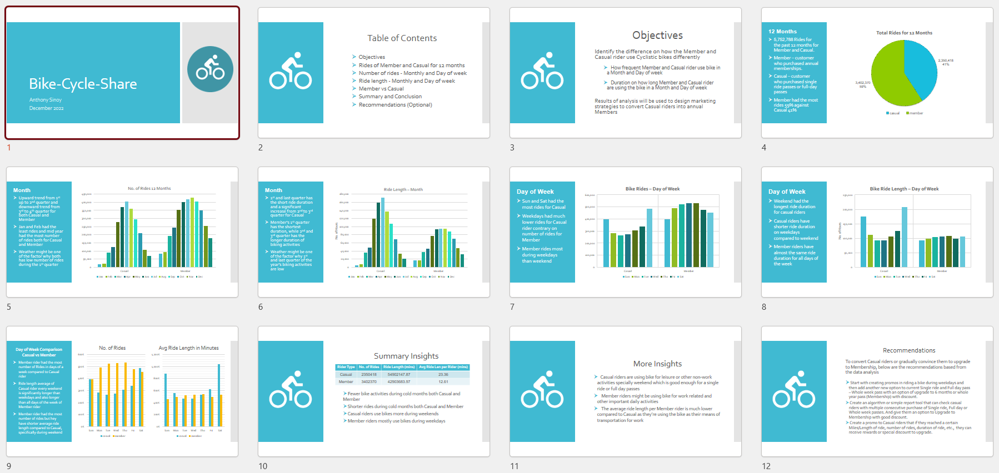

# Bike-Cycle-Share
  <b> Bike-Cycle-Share is a bike-share company that features more than 6,000 bicycles and 700 docking stations spreads across the city.</b> 

## Objectives - Problem Statement

  <b>Identify the difference on how the Member and Casual rider use Cyclistic bikes differently</b>

    - How frequent Member and Casual rider use bike in a Month and Day of week

    - Duration on how long Member and Casual rider are using the bike in a Month and Day of week

    - Results of analysis will be used to design marketing strategies to convert Casual riders into annual Members

## Data Analysis Presentation

